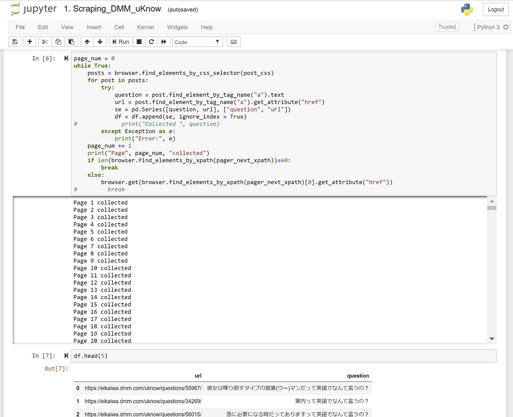
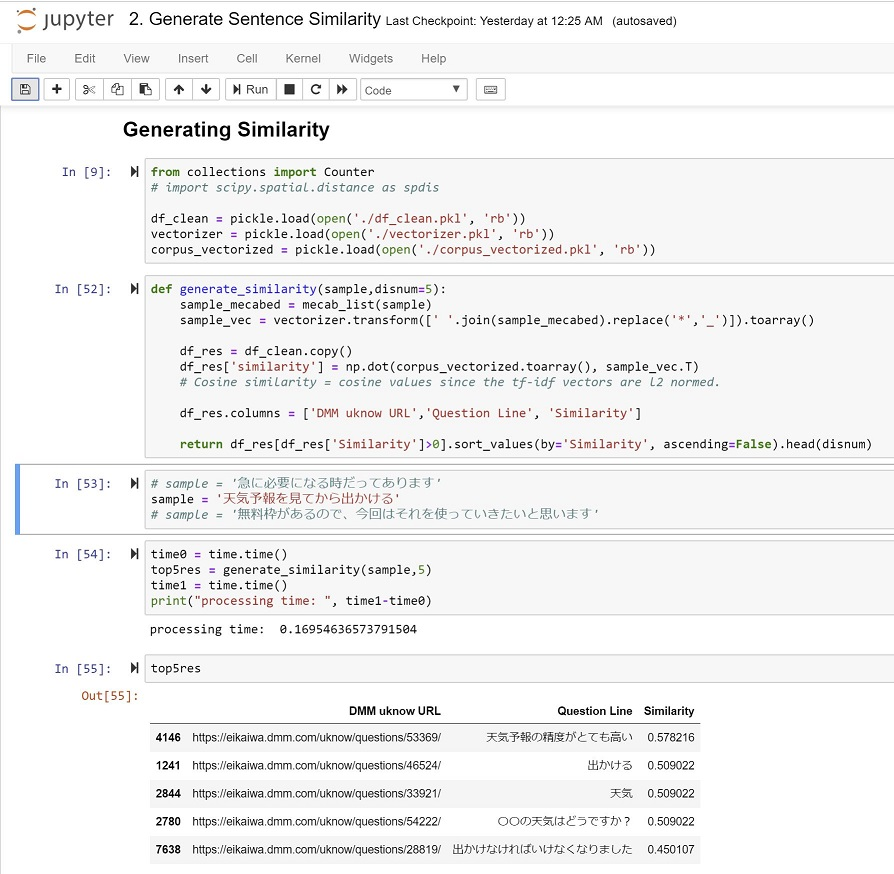
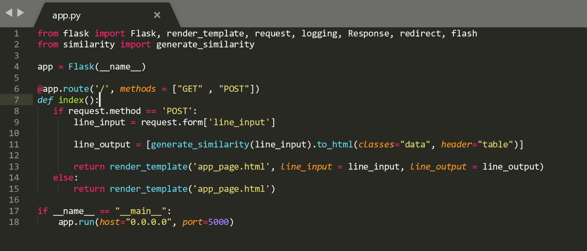
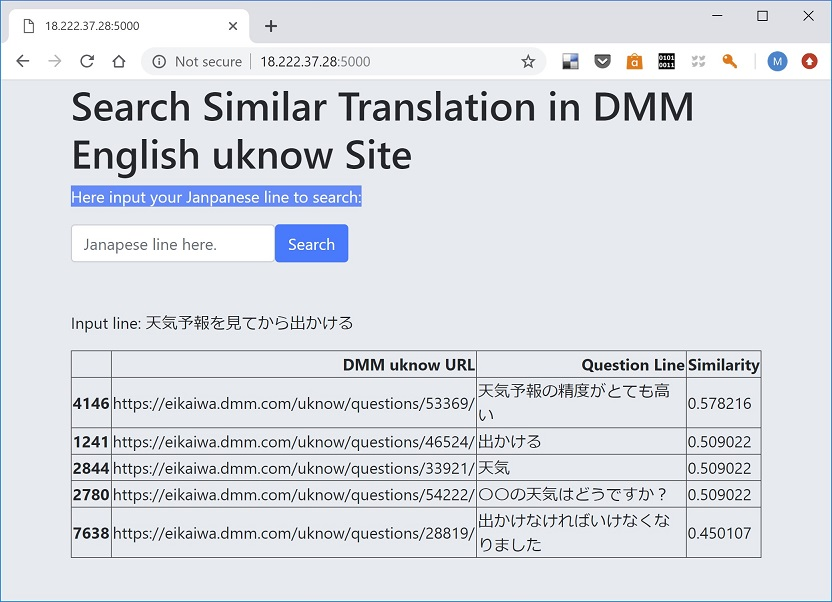
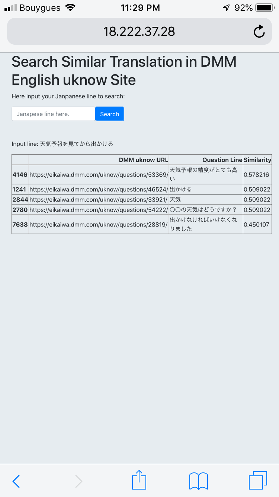

# SimilarLineFromDMM

</br>

## Background

<a href="https://eikaiwa.dmm.com/uknow/">"DMM英会話なんてuKnow?"</a> (my translation is "DMM: how do you say it in English conversation?") is a free web site service where a site visitor posts a Japanese sentence and English experts (eg English teachers, native speakers etc.) replies its English translations as they believe their reply/replies suit the questioner's situation the most.

By today (March 11th, 2019), 60K+ questions were posted and 150K+ English translations were answered.

   </br>
   

</br>

This web site contains innumerable amounts of *Japanese sentence-English sentence* sets and they are much better for Japanese-speaking-as-the-first-language English learners than a Japanese-English dictionary in the ways that: 
</br>
- the DMM site contains the sentences, not just words, and
- one Japanese sentence is translated into multiple English candidates, which let the site visitors recognize the range of possible English expressions and have a chance to select the one matching their own situation the best.

</br>

__My intenstion this time has been to make a wrap-up app to retrieve the Japanese sentences which have been ever posted in the DMM site, similar to a Japanese sentence the app user requested, by similarity order.__

</br>

<hr>

In this repository, I saved the files for my personal app which does: 
###  1) web scraping from "DMM English uknow" site pages on Python and *selenium* package, 
   - ./local_files/1. Scraping_DMM_uKnow.ipynb
   </br>
   
</br>
</br>

###  2) establishment of data pipeline to calculate Japanese sentence similarity based on TF-IDF processed over scraped Japanese sentences at step 1) and encoded by *MeCab*, 
   - ./local_files/2. Generate Sentence Similarity.ipynb
   </br>
   
</br>
</br>

###  3) deployment as an app returning similar Japanese sentence by similarity order against user-posted Japanese sentence using *Flask*, and 
   - ./AWS_files/similarity.py
   - ./AWS_files/app.py
   </br>
   
</br>
</br>

###  4) making the app externally accessible through HTML by running it on AWS Linux instance.
   
</br>

As a matter of course, the same app can be accessible from cell phones.

</br>

</br>

</br>

<hr>

</br>

##  1) Web scraping from "DMM English uknow" site pages on Python and *selenium* package.
</br>
The whole process in this step was implemented on Jupyter Notebook as ./local_files/1. Scraping_DMM_uKnow.ipynb, and the following is the 'un-ipynb-ed' code block:
</br>
```python
from selenium import webdriver
import pandas as pd

chrome_options = webdriver.ChromeOptions()
chrome_options.add_argument("--no-sandbox")
chrome_options.add_argument("--disable-setuid-sandbox")

browser = webdriver.Chrome(executable_path="C:\Drivers\chromedriver\chromedriver.exe")
url = "https://eikaiwa.dmm.com/uknow/new_answer/"
browser.get(url)

# Element Selector
post_css = "div.container-padding.border-all-solid.link"
pager_next_xpath = "//a[@rel='next']"
df = pd.read_csv("default.csv", index_col=0)

page_num = 0
while True:
    posts = browser.find_elements_by_css_selector(post_css)
    for post in posts:
        try:
            question = post.find_element_by_tag_name("a").text
            url = post.find_element_by_tag_name("a").get_attribute("href")
            se = pd.Series([question, url], ["question", "url"])
            df = df.append(se, ignore_index = True)
        except Exception as e:
            print("Error:", e)
    page_num += 1
    print("Page", page_num, "collected")
    if len(browser.find_elements_by_xpath(pager_next_xpath))==0:
        break
    else:
        browser.get(browser.find_elements_by_xpath(pager_next_xpath)[0].get_attribute("href"))

df.to_csv("output.csv", encoding="utf-16")
```


