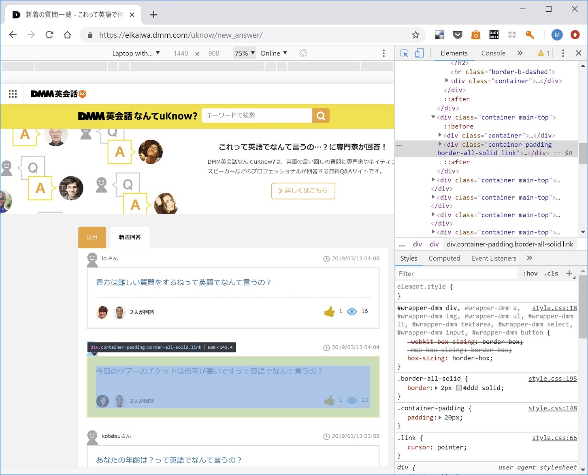

# SimilarLineFromDMM
</br> 

*keywords:*
- python
- web crawling using selenium
- text mining
- MeCab
- TF-IDF
- sentence similarity
- flask
- web app served from Amazon AWS
- HTML Bootstrap

</br>

## Background

<a href="https://eikaiwa.dmm.com/uknow/">"DMM英会話なんてuKnow?"</a> (my translation is "DMM: how do you say it in English conversation?") is a free web site service where a site visitor posts a Japanese sentence and English experts (eg English teachers, native speakers etc.) replies its English translations as they believe their reply/replies suit the questioner's situation the most.

By today (March 11th, 2019), 60K+ questions were posted and 150K+ English translations were answered.

   </br>
   

</br>

This web site contains innumerable amounts of *Japanese sentence-English sentence* sets and they are much better for Japanese-speaking-as-the-first-language English learners than a Japanese-English dictionary in the ways that: 
</br>
- the DMM site contains the sentences, not just words, and
- one Japanese sentence is translated into multiple English candidates, which let the site visitors recognize the range of possible English expressions and have a chance to select the one matching their own situation the best.

</br>

__My intention this time has been to make a wrap-up app to retrieve the Japanese sentences which have been ever posted in the DMM site, similar to a Japanese sentence the app user requested, by similarity order.__

</br>

<hr>

In this repository, I saved the files for my personal app which does: 
###  1) web scraping from "DMM English uknow" site pages on Python and *selenium* package, 
   - ./local_files/1. Scraping_DMM_uKnow.ipynb
   </br>
   
</br>
</br>

###  2) establishment of data pipeline to calculate Japanese sentence similarity based on TF-IDF processed over scraped Japanese sentences at step 1) and encoded by *MeCab*, 
   - ./local_files/2. Generate Sentence Similarity.ipynb
   </br>
   
</br>
</br>

###  3) deployment as an app returning similar Japanese sentence by similarity order against user-posted Japanese sentence using *Flask*, and 
   - ./AWS_files/similarity.py
   - ./AWS_files/app.py
   - ./AWS_files/templates/app_page.html
   </br>
   
</br>
</br>

###  4) making the app externally accessible through HTML by running it on AWS Linux instance.
   
</br>

As a matter of course, the same app can be accessible from cell phones.

</br>

</br>

</br>

<hr>

</br>

##  1) Web scraping from "DMM English uknow" site pages on Python and *selenium* package.
</br>
The whole process in this step was implemented on Jupyter Notebook as ./local_files/1. Scraping_DMM_uKnow.ipynb, and the following is the 'un-ipynb-ed' code block:

</br>

```python
from selenium import webdriver
import pandas as pd

chrome_options = webdriver.ChromeOptions()
chrome_options.add_argument("--no-sandbox")
chrome_options.add_argument("--disable-setuid-sandbox")

browser = webdriver.Chrome(executable_path="C:\Drivers\chromedriver\chromedriver.exe")
url = "https://eikaiwa.dmm.com/uknow/new_answer/"
browser.get(url)

# Element Selector
post_css = "div.container-padding.border-all-solid.link"
pager_next_xpath = "//a[@rel='next']"
df = pd.read_csv("default.csv", index_col=0)

page_num = 0
while True:
    posts = browser.find_elements_by_css_selector(post_css)
    for post in posts:
        try:
            question = post.find_element_by_tag_name("a").text
            url = post.find_element_by_tag_name("a").get_attribute("href")
            se = pd.Series([question, url], ["question", "url"])
            df = df.append(se, ignore_index = True)
        except Exception as e:
            print("Error:", e)
    page_num += 1
    print("Page", page_num, "collected")
    if len(browser.find_elements_by_xpath(pager_next_xpath))==0:
        break
    else:
        browser.get(browser.find_elements_by_xpath(pager_next_xpath)[0].get_attribute("href"))

df.to_csv("output.csv", encoding="utf-16")
```

</br>

This code using *selenium* package is supposed to crawl this kind of website pages one by one:
 


</br>

This web page contains the blocks with Japanese lines that the web page visitors posted to ask for English translation, with links to another page having ‘answers’ by experts. Using Chrome DevTools, find the CSS selectors or other identifiers to locate the positions of Japanese lines. Finally also find a selector for the ‘next page’ and set to repeat the same crawling in another similar pages with Japanese sentence blocks again and again.

The final output will be saved as a CSV file output.csv in the end. 

Since my crawler does not include the appropriate set up for the permission request about the crawling, it stopped after crawling out a thousand pages, with nearly ten thousands Japanese lines. So I should have done a better job, but for a this illustration purpose I left it to a future improvement for now.

</br>

<hr>

</br>

##  2) Establishing data pipeline to calculate Japanese sentence similarity based on TF-IDF processed over scraped Japanese sentences at step 1) and encoded by *MeCab*.
</br>
To do the text mining on the crawled Japanese sentences, the first job is to split a sentence into words. You may or may not know, the raw Japanese is the sequence of characters not the sequence of words, and which series of characters consists of a word cannot be mechanically obvious.

</br>

A famous example is "すもももももももものうち" (meaning 'Both plums and peaches are members of the peach family.') This sentence consists of 7 words and 12 characters, 8 characters out of 12 are exactly the same 'も' (reads *mo*).

</br>

This job is notorious for being tough to do because the algorithm should handle the sentences in a semantic way. Generally, people start the analysis with the programs somebody already created to do this job. <a href='https://en.wikipedia.org/wiki/MeCab'>MeCab</a> is one of the most famous packages to do that job.

</br>

With MeCab a sentence will be partitioned into a set of words with their classes, the original forms if they are conjugated and the other useful information. The following mecab output for "すもももももももものうち" represents it returns the 7 words in each line of output along with their grammatical information.

</br>

```
% mecab
すもももももももものうち
すもも  名詞,一般,*,*,*,*,すもも,スモモ,スモモ
も      助詞,係助詞,*,*,*,*,も,モ,モ
もも    名詞,一般,*,*,*,*,もも,モモ,モモ
も      助詞,係助詞,*,*,*,*,も,モ,モ
もも    名詞,一般,*,*,*,*,もも,モモ,モモ
の      助詞,連体化,*,*,*,*,の,ノ,ノ
うち    名詞,非自立,副詞可能,*,*,*,うち,ウチ,ウチ
EOS
```

</br>

Next is to choose the words to potentially represent the similarity of sentences. This time I selected only nouns, verbs, adjectives, and adverbs. Because of the following possible issues, I encoded the words in to the series of identifiers instead of using them as they are:
- The form of the word can vary because of the conjugation
- Same read words can have different meanings 

</br>

```python
import MeCab
m = MeCab.Tagger ("-Ochasen")

from pykakasi import kakasi
kakasi = kakasi()
kakasi.setMode('H', 'a')
kakasi.setMode('K', 'a')
kakasi.setMode('J', 'a')
conv = kakasi.getConverter()

def mecab_list(text,ctr=0):
    tagger = MeCab.Tagger("-Ochasen")
    tagger.parse('')
    node = tagger.parseToNode(text)
    word_class = []
    result = []
    while node:
        word = node.surface
        wclass = node.feature.split(',')
        if (conv.do(word).isalpha() == True or conv.do(wclass[6]).isalpha() == True) and \
            (wclass[0] == '名詞' or (wclass[0] == '動詞' and wclass[1] == '自立') or wclass[0] == '形容詞' or wclass[0] == '`副詞'):
            p1 = ''
            p2 = ''
            if wclass[0] == '名詞':
                p1 = 'no'
                p2 = 'g'
            elif wclass[0] == '動詞':
                p1 = 've'
                if wclass[1] == '自立':
                    p2 = 'i'
            elif wclass[0] == '形容詞':
                p1 = 'aj'
                p2 = 'g'
            else:
                p1 = 'av'
                p2 = 'g'
                
            try:
                word_class.append((word,wclass[0],wclass[1],wclass[6],wclass[7],conv.do(wclass[6])))
                result.append(conv.do(wclass[6]) + '_' + p1 + '_' + p2 + '_' + wclass[6])
            except:
                word_class.append((word,wclass[0],wclass[1],wclass[6],word,conv.do(word)))
                result.append(conv.do(word) + '_' + p1 + '_' + p2 + '_' + wclass[6])
        node = node.next
    if ctr == 0:
        return result
    elif ctr == 1:
        return word_class

mecab_list("つけ麺は水でしめてるからコシがある")

Out: ['tsuke_no_g_つけ',
 'men_no_g_麺',
 'mizu_no_g_水',
 'shimeru_ve_i_しめる',
 'koshi_no_g_*',
 'aru_ve_i_ある']
```

</br>

<a href="https://en.wikipedia.org/wiki/Tf%E2%80%93idf">TF-IDF</a> is a simple and easy algorithm to vectorize the sentences from a corpus. I treated the approximately 10,000 Japanese sentences crawled at step 1 as a corpus and vectorize them. I tried my version of the function to vectorize sentences but in the end I just used a package *TfidfVectorizer* to do in the pursuit of a better performance in the final app.

</br>

```python
from sklearn.feature_extraction.text import TfidfVectorizer

def attach_tfidf_vector(path):
    df = pd.read_csv(path,
                    sep = ",", 
                    encoding = "utf-16", 
                    error_bad_lines = 0,
    )
    print ("There are " + str(df.shape[0]) + " candidates.")

    print("Preprocessing using MeCab...")
    time0 = time.time()
    df["question_clean"] = df["question"].str.split('って英語でなんて言うの', expand=True)[0]
    df['words'] = df['question_clean'].apply(mecab_list)
    df['question_cd'] = df['words'].apply(' '.join)
    df = df[df['words'].apply(len)!=0].reset_index(drop=True)
    df['words_count'] = df['words'].apply(len)
    time1 = time.time()
    print("Preprocessing time: ",time1 - time0)    

    corpus = [document.replace('*','_') for document in df['question_cd']]
    vectorizer = TfidfVectorizer(lowercase=False)
    
    time0 = time.time()
    corpus_vectorized = vectorizer.fit_transform(corpus)
    time1 = time.time()
    time1 - time0
    print("TF_IDF processing time: ",time1 - time0)
    
    return df[['url','question_clean']], vectorizer, corpus_vectorized
    
df_clean, vectorizer, corpus_vectorized  = attach_tfidf_vector("C:/Project/DMM_uKnow_Scraping/output.csv")

```

</br>

__The downside of the TF-IDF is that it does not treat the words in a semantic way__; even when there are the words having the super similar meaning or even having the same meaning just with different representations, they are just treated as the different words and separate elements in the vector. This potentially leads to non-sense results when treating long documents, but I believe in this case this deficiency appears limitedly because we only compare short sentences and we are more interested in word-by-word since it is for the translation purpose.

</br>

After vectorization, the vectorizes matrix (row x column: sentences in the corpus x bag of words), the vectorizer, the pandas dataframe of original sentences were saved to pickles files.

</br>

```python
pickle.dump(df_clean, open('./df_clean.pkl', 'wb')), print("Saved data frame with clean question lines to df_clean.pkl")
pickle.dump(vectorizer, open('./vectorizer.pkl', 'wb')), print("Saved trained vectorizer to vectorizer.pkl")
pickle.dump(corpus_vectorized, open('./corpus_vectorized.pkl', 'wb')), print("Saved vectorized corpus to corpus_vectorized.pkl")
```

</br>

Finally the similarity is based on the normalized cosine value between vectorized sentences. The following function *generate_similarity* will have the argument of the arbitrary user-input Japanese sentence, calculate cosine similarities over the corpus sentences against the input sentence, and return the top 5 most similar sentences.

</br>

```python
def generate_similarity(sample,disnum=5):
    sample_mecabed = mecab_list(sample)
    sample_vec = vectorizer.transform([' '.join(sample_mecabed).replace('*','_')]).toarray()

    df_res = df_clean.copy()
    df_res['similarity'] = np.dot(corpus_vectorized.toarray(), sample_vec.T) 
    # Cosine similarity = cosine values since the tf-idf vectors are l2 normed.

    df_res.columns = ['DMM uknow URL','Question Line', 'Similarity']
    
    return df_res[df_res['Similarity']>0].sort_values(by='Similarity', ascending=False).head(disnum)
    
sample = '天気予報を見てから出かける'
generate_similarity(sample,5)

Out:

      DMM uknow URL	                                 Question Line	            Similarity
4146	https://eikaiwa.dmm.com/uknow/questions/53369/	天気予報の精度がとても高い	  0.578216
1241	https://eikaiwa.dmm.com/uknow/questions/46524/	出かける	                  0.509022
2844	https://eikaiwa.dmm.com/uknow/questions/33921/	天気	                       0.509022
2780	https://eikaiwa.dmm.com/uknow/questions/54222/	〇〇の天気はどうですか？	   0.509022
7638	https://eikaiwa.dmm.com/uknow/questions/28819/	出かけなければいけなくなりました	0.450107

```

</br>

<hr>

</br>

##  3) Deployment as an app returning similar Japanese sentence by similarity order against user-posted Japanese sentence using *Flask*.
</br>

*Flask* is a handy python package which API-nizes the Python code. There are some grammar we need to understand to begin with but once the code is ready to accept the POST requests from a user-input sentence the code treats it as a variable inside the code. 

</br>

```python
from flask import Flask, render_template, request, logging, Response, redirect, flash
from similarity import generate_similarity

app = Flask(__name__)

@app.route('/', methods = ["GET" , "POST"])
def index():
   if request.method == 'POST':
       line_input = request.form['line_input'] 

       line_output = [generate_similarity(line_input).to_html(classes="data", header="table")]

       return render_template('app_page.html', line_input = line_input, line_output = line_output)
   else:
       return render_template('app_page.html')

app.run(host="localhost")
```

</br>

I also prepare a simple HTML page using Bootstrap, and now the HTML page which accepts the input and returns the similar sentences out of the corpus is ready BUT STILL FOR MY OWN USE ONLY! 
In the next step, we will see how we can deploy this to the world to let anyone can access and use this app using AWS.

<br>

```html
<!DOCTYPE html><html lang="ja">
<html>
<head>
	<title></title>
	<link rel="stylesheet" href="https://maxcdn.bootstrapcdn.com/bootstrap/4.0.0/css/bootstrap.min.css" integrity="sha384-Gn5384xqQ1aoWXA+058RXPxPg6fy4IWvTNh0E263XmFcJlSAwiGgFAW/dAiS6JXm" crossorigin="anonymous">
	<style type="text/css" media="screen">
		body{
			background-color:#e6ecf0;
		}	
	</style>
</head>
<body>
	<div class="container">
		<div class="row">
			<div class="col-md-12 mb-5">
				<h1>Search Similar Translation in DMM English uknow Site</a></h1>
				<p>Here input your Janpanese line to search:</p>
				<form class="form-inline" method="post">
					<div class="form-group">
						<label class="sr-only" for="line_input"></label>
						<div class="input-group">
							<input id="line_input" name="line_input" placeholder="Janapese line here." type="text" class="form-control">
						</div>
					</div>
					<button type="submit" class="btn btn-primary">Search</button>
				</form>
			</div>
		</div>
		<div class="row">
			
				<div class="col-md-12 mb-3">Input line: {{ line_input }}</div>
				<div class="col-md-12">
					
					<!-- <div class="col-md-12"> -->
						
							<a href=' {{ table|safe }} '>DMM uknow Page</a>
						
							{{ table|safe }}
						
						<!-- {{ line_ouput }} -->
					<!-- </div> -->
					
				</div>
			
		</div>
	</div>

</body>
</html>
```


</br>

<hr>

</br>

##  4) Making the app externally accessible through HTML by running it on AWS Linux instance.
</br>
There is a long line of items to learn for a beginner to start first AWS EC2 instance. As an example, see <a href='https://docs.aws.amazon.com/AWSEC2/latest/UserGuide/EC2_GetStarted.html#ec2-launch-instance'>AWS official tutorial</a> to set up the AWS EC2 Linux instance.

</br>

When we prepare a server for an app, it is virtually indispensable to prepare requirement.txt to show what packages are prerequisite of the app. 

</br>

```
pandas==0.24.1
numpy==1.15.4
scikit-learn==0.20.2
Flask==1.0.2
pykakasi==0.94
requests==2.21.0
pyopenssl==19.0.0
line-bot-sdk==1.8.0
gunicorn==19.9.0
Flask-SSLify==0.1.5
```

</br>

This is not just a memo of packages but also a usable to download packages automatically. In Linux, it can be done from the terminal by:
```
pip install -r requirements.txt
```

</br>

In our case, downloading MeCab to AWS instance was the far most difficult part of the preparations because it cannot be done by requirement.txt. To do this, refer to <a href='https://www.yoshiislandblog.net/2018/03/21/amazon-linux_mecab/'>this page</a> or <a href='https://www.iruca21.com/entry/2017/03/26/191846'>this page</a> (both in Japanese).

</a>

The app.py has a minor edits on where to serve the HTML page at app.run portion. When it runs successfully with:
```
python app.py
```
on terminal, the HTML page should be accessible at *[public IP address of   AWS incetance]:[port number assigned in the code]*. For my AWS instance, it was *18.222.37.28:5000* (currently intentionally inactivated). 

</br>

```python
from flask import Flask, render_template, request, logging, Response, redirect, flash
from similarity import generate_similarity

app = Flask(__name__)

@app.route('/', methods = ["GET" , "POST"])
def index():
   if request.method == 'POST':
       line_input = request.form['line_input'] 

       line_output = [generate_similarity(line_input).to_html(classes="data", header="table")]

       return render_template('app_page.html', line_input = line_input, line_output = line_output)
   else:
       return render_template('app_page.html')

if __name__ == "__main__":
    app.run(host="0.0.0.0", port=5000)
```

</br>

Since it in public it can be accessible from any devices including cell phones.

</br>


</br>


</br>
