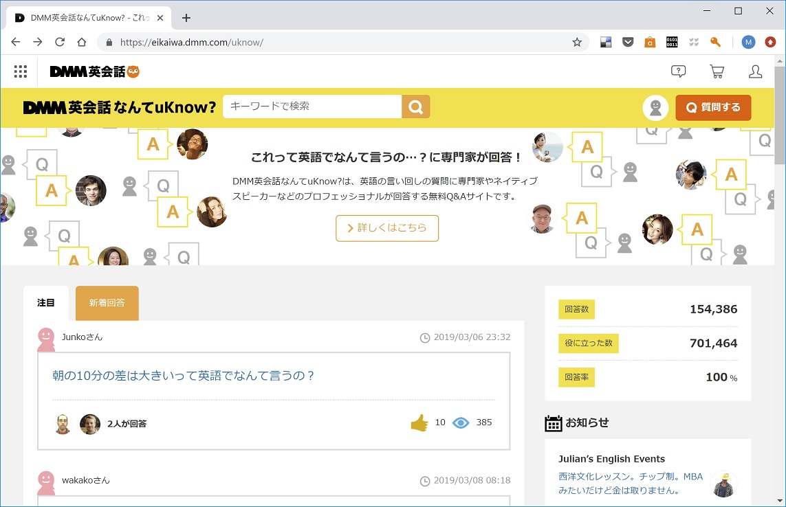

# SimilarLineFromDMM
</br> 

*keyword: python, web crawling, selenium, text mining, MeCab, TF-IDF, sentence similarity, flask, web app served from Amazon AWS, HTML Bootstrap*

</br>

## Background

<a href="https://eikaiwa.dmm.com/uknow/">"DMM英会話なんてuKnow?"</a> (my translation is "DMM: how do you say it in English conversation?") is a free web site service where a site visitor posts a Japanese sentence and English experts (eg English teachers, native speakers etc.) replies its English translations as they believe their reply/replies suit the questioner's situation the most.

By today (March 11th, 2019), 60K+ questions were posted and 150K+ English translations were answered.

   </br>
   

</br>

This web site contains innumerable amounts of *Japanese sentence-English sentence* sets and they are much better for Japanese-speaking-as-the-first-language English learners than a Japanese-English dictionary in the ways that: 
</br>
- the DMM site contains the sentences, not just words, and
- one Japanese sentence is translated into multiple English candidates, which let the site visitors recognize the range of possible English expressions and have a chance to select the one matching their own situation the best.

</br>

__My intenstion this time has been to make a wrap-up app to retrieve the Japanese sentences which have been ever posted in the DMM site, similar to a Japanese sentence the app user requested, by similarity order.__

</br>

<hr>

In this repository, I saved the files for my personal app which does: 
###  1) web scraping from "DMM English uknow" site pages on Python and *selenium* package, 
   - ./local_files/1. Scraping_DMM_uKnow.ipynb
   </br>
   
</br>
</br>

###  2) establishment of data pipeline to calculate Japanese sentence similarity based on TF-IDF processed over scraped Japanese sentences at step 1) and encoded by *MeCab*, 
   - ./local_files/2. Generate Sentence Similarity.ipynb
   </br>
   
</br>
</br>

###  3) deployment as an app returning similar Japanese sentence by similarity order against user-posted Japanese sentence using *Flask*, and 
   - ./AWS_files/similarity.py
   - ./AWS_files/app.py
   </br>
   
</br>
</br>

###  4) making the app externally accessible through HTML by running it on AWS Linux instance.
   
</br>

As a matter of course, the same app can be accessible from cell phones.

</br>

</br>

</br>

<hr>

</br>

##  1) Web scraping from "DMM English uknow" site pages on Python and *selenium* package.
</br>
The whole process in this step was implemented on Jupyter Notebook as ./local_files/1. Scraping_DMM_uKnow.ipynb, and the following is the 'un-ipynb-ed' code block:
</br>

```python
from selenium import webdriver
import pandas as pd

chrome_options = webdriver.ChromeOptions()
chrome_options.add_argument("--no-sandbox")
chrome_options.add_argument("--disable-setuid-sandbox")

browser = webdriver.Chrome(executable_path="C:\Drivers\chromedriver\chromedriver.exe")
url = "https://eikaiwa.dmm.com/uknow/new_answer/"
browser.get(url)

# Element Selector
post_css = "div.container-padding.border-all-solid.link"
pager_next_xpath = "//a[@rel='next']"
df = pd.read_csv("default.csv", index_col=0)

page_num = 0
while True:
    posts = browser.find_elements_by_css_selector(post_css)
    for post in posts:
        try:
            question = post.find_element_by_tag_name("a").text
            url = post.find_element_by_tag_name("a").get_attribute("href")
            se = pd.Series([question, url], ["question", "url"])
            df = df.append(se, ignore_index = True)
        except Exception as e:
            print("Error:", e)
    page_num += 1
    print("Page", page_num, "collected")
    if len(browser.find_elements_by_xpath(pager_next_xpath))==0:
        break
    else:
        browser.get(browser.find_elements_by_xpath(pager_next_xpath)[0].get_attribute("href"))

df.to_csv("output.csv", encoding="utf-16")
```


The *selenium* package is supposed to crawl this kind of website pages one by one:


This page contains the blocks with Japanese lines that the web page visitors posted, with links to another page having ‘answers’ by experts. Using Chrome dev tool, find the CSS selectors or other identifiers to locate the positions of Japanese lines. Finally also find a selector for the ‘next page’ and set to repeat the same crawling in another pages again and again.


The final output will be saved as a CSV file output.csv in the end. 

Since my crawler does not include the appropriate set up for the permission request about the crawling, it stopped after crawl out of a few hundred pages, with nearly a thousand Japanese lines. So I should have done a better job, but for a illustration purpose I left it to a future improvement for now.


To do the text mining on the crawled Japanese sentences, the first job is to split the lines into separate words. You may or may not know, the raw Japanese is the sequence of characters not the sequence of words. 


This job is very tough to do because the algorithm should handle the sentences in a semantic way not only in a mechanical way. generally people start out with the program somebody already has created to do this job. MeCab is one of the most famous packages to do that job.


With MeCab a sentence will be partitioned into a set of words with their classes, the original forms if they are conjugated and the other useful information.


Next is to choose the words to potentially represent the similarity of sentences. This time I selected only nouns, verbs, adjectives, and adverbs. Because of the following possible issues, I encoded the words in to the series of identifiers instead of using them as they are:
 the form of the word can vary because of the conjugation
Same read words can have different meanings 


TF-IDF is a simple and easy algorithm to vectorize the sentences from a corpus (LINK). I treated the crawled 10000 Japanese sentences as a corpus and vectorize them. I tried my version of the function to vectorize sentences but in the end I just used a package XXXX to do in the pursuit of a better performance in the final app.

The downside of the TF-IDF is that it does not treat the words in a semantic way; even when there are the words having the super similar meaning or even the same meaning with different representations, they are just treated as the different words and separate elements in the vector. This potentially leads to non-sense results when treating long documents, but I believe in this case this deficiency appears limitedly because we only compare short sentences and we are more interested in word-by-word since it is for the translation purpose.

After vectorization, the vecteoizes matrix (row x column: sentences in the corpus x bag of words), the vectorizer, the dataframe of original sentences were saved to pickles files.


Finally the similarity is based on the normalized cosine value between vectorized sentences. The function XXX will have the argument of the arbitrary user-input Japanese sentence, calculate cosine similarities over the corpus sentences against the input sentence, and return the top 5 most similar sentences.


Flask is a handy package which API-nizes the Python code. There are some grammar we need to understand to begin but once the code accepts the POST requests as a user-input sentence the code treats it as a variable inside the code. 

I also prepare a simple HTML page using Bootstrap (LINK), and now the HTML page which accepts the input and returns the similar sentences from the corpus is ready BUT STILL FOR MY OWN USE ONLY! 
In the next step, we will see how we can deploy this to the world to let anyone can access and use this app using AWS.


There is a long line of items to learn for a beginner to start first AWS EC2 instance. Refer to this for example: LINK.

When we prepare a server pf an app, it is virtually indispensable to prepare requirement.txt to show what packages are prerequisite of the app. This is not just a memo of packages but also a usable to download packages automatically. In Linux, it can be done from the terminal by:
CODE

In our case, downloading MeCab to AWS instance was the far most difficult part of the preparations because it cannot be done by requirement.txt. XXXXXXX

The app.py has a minor edits on where to serve the HTML page at app.run portion. When it runs successfully, the HTML page should be accessible at [public IP address of   AWS incetance]:[port number assigned in the code]. For my version, it was 18.222.37.28:5000. 


Since it in public it can be accessible from other devices such as my cell phone.

